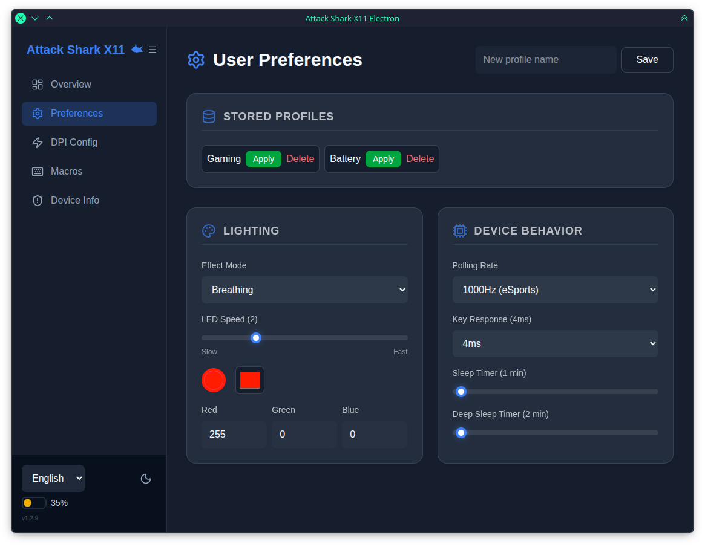

# attack-shark-x11-electron-ru



[](LICENSE)
[](https://bun.sh)

Кроссплатформенное десктопное приложение для настройки игровой мыши **Attack Shark X11** — DPI, макросы, подсветка, частота опроса и многое другое. Создано на Electron + Vue 3.

Форк [драйвера dressedinblack5](https://github.com/dressedinblack5/attack-shark-x11-electron) с переводом на Руский язык.

---

## Быстрая установка

```bash
curl -fsSL https://raw.githubusercontent.com/liyaFPV/attack-shark-x11-electron-ru/main/install.sh | bash
```

Скрипт собирает приложение из исходников — вам понадобятся только Bun, Rust и C-компилятор.
Он делает всё сам: устанавливает зависимости, собирает проект, создаёт ярлык на рабочем столе и настраивает правила udev.

### Удаление

```bash
rm -f ~/.local/bin/attack-shark-x11
rm -f ~/.local/share/applications/attack-shark-x11.desktop
rm -f ~/.local/share/icons/hicolor/scalable/apps/attack-shark-x11.svg
sudo rm -f /etc/udev/rules.d/99-attack-shark-x11.rules
sudo udevadm control --reload-rules
```

---

## Возможности

**Управление устройством** — ступени DPI, переназначение кнопок, макросы с таймингом, подсветка (режим/скорость/цвет), частота опроса (125–1000 Гц), мониторинг батареи, сброс устройства.

**Поддерживаемые модели** — Attack Shark **X11** и **R1** (автоопределение при запуске).

**Возможности приложения** — тёмная/светлая/капучино темы, i18n (EN/ES/RU), автосохранение, полное сохранение конфигурации между перезапусками, типобезопасная загрузка настроек, автоопределение подключённого устройства при запуске.

**Платформа** — Linux, macOS, Windows. 145 тестов в 12 файлах.

**USB-стек** — Полностью перенесён с `usb` v2 (node-usb, синхронный Transfer API) на `usb` v3 (node-usb-rs, асинхронный WebUSB API). Мониторинг батареи использует опрос прерывающего endpoint через `nativeTransferIn`. Исправление upstream-бага отправлено (node-usb-rs#4).

---

## Настройка Linux (udev)

Мыши требуется правило udev, чтобы приложение могло получить к ней доступ без `sudo`:

```bash
# 1. Создайте файл правил
sudo tee /etc/udev/rules.d/99-attack-shark-x11.rules > /dev/null <<'UDEV'
SUBSYSTEM=="usb", ATTR{idVendor}=="1d57", ATTR{idProduct}=="fa60", MODE="0666", GROUP="plugdev"
SUBSYSTEM=="usb", ATTR{idVendor}=="1d57", ATTR{idProduct}=="fa55", MODE="0666", GROUP="plugdev"
SUBSYSTEM=="usb", ATTR{idVendor}=="1d57", ATTR{idProduct}=="fa61", MODE="0666", GROUP="plugdev"
UDEV

# 2. Перезагрузите правила
sudo udevadm control --reload-rules && sudo udevadm trigger
```

---

## Сборка из исходников

Требование: [Bun](https://bun.sh/)

```bash
git clone https://github.com/dressedinblack5/attack-shark-x11-electron.git
cd attack-shark-x11-electron
bun install
bun run package     # результат в ./dist
```

```bash
bun test            # 145 тестов
```

---

## Характеристики устройства

| | |
|---|---|
| **Сенсор** | PixArt PAW3311 |
| **Макс. DPI** | 22 000 (6 уровней) |
| **Частота опроса** | 125–1000 Гц |
| **Вес** | ~63 г |
| **Батарея** | До 65 ч / зарядка 2–3 ч |
| **Подключение** | Проводное + 2.4ГГц беспроводное (Bluetooth не тестировался) |
| **Vendor / Product** | `0x1d57` / `0xfa60` (беспроводное), `0xfa55` (X11 проводное), `0xfa61` (R1 проводное) |

---

## Поддерживаемое оборудование

| Устройство | Режим | Статус |
|---|---|---|
| Attack Shark X11 | Проводной | ✅ Поддерживается (подсветка ограничена аппаратно только в беспроводном режиме) |
| Attack Shark X11 | 2.4ГГц беспроводной | ✅ Поддерживается |
| Attack Shark X11 | Bluetooth | ✅ Поддерживается |
| Attack Shark R1 | Проводной | ✅ Поддерживается |
| Attack Shark R1 | 2.4ГГц беспроводной | ✅ Поддерживается (через совместимость с X11) |
| Attack Shark **X11SE** | Все режимы | ✅ Вероятно совместим (тот же чипсет, не тестировался) |

---

## Участие в проекте

Проект основан на реверс-инжиниринге. PR приветствуются для документации протокола, новых функций или тестирования оборудования. См. `docs/` для анализа пакетов.

---

## Лицензия

MIT © [HarukaYamamoto0](https://github.com/HarukaYamamoto0)

*Не связан с Attack Shark. Используйте на свой страх и риск.*

---

## Благодарности

Особая благодарность сообществу реверс-инжиниринга, чья работа сделала это возможным:

- **[HarukaYamamoto0](https://github.com/HarukaYamamoto0)** — за оригинальный драйвер X11, детальный анализ протокола и исследование прошивки, которые легли в основу этого проекта.
- **[xb-bx](https://github.com/xb-bx)** — за драйвер Attack Shark R1, документацию протокола и тестирование оборудования, что позволило добавить поддержку R1.

---

## Перевод

Русская локализация и перевод README выполнены **LiyaFPV**. 